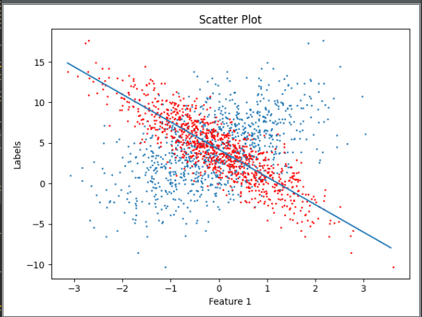
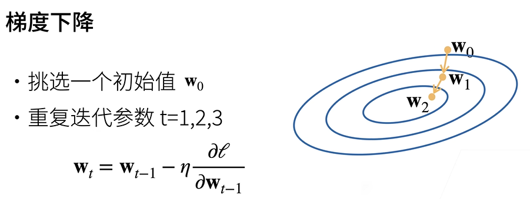
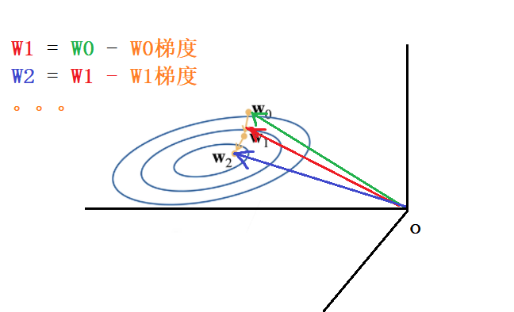
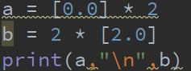
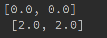
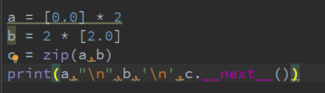
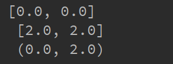
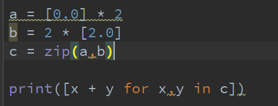
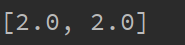

# <u>Dive-Into-Deeplearning学习笔记 </u>

# 线性回归

        线性回归是一种简单的回归模型，其作用是预测一个线性的连续



## 线性模型

        假设n维输入向量
        $$ 
        \mathbf{x} = [x_1, x_2, \ldots, x_n]^T 
        $$

        输出结果为 $\mathbf{y}=w_1 * x_1 + w_2 *x_2 + ...+w_n*x_n + b$    

        $w$表示 weight 权重   $b$表示bias 偏移

               其中 $\mathbf{w} = [w_1, w_2, \ldots, w_n]^T$

         这里 线性回归要做的任务就是通过已有的一些离散的点去拟合出一组$\mathbf{w},b$ 得到一条曲线用以预测关于对应特征的关系

        $\hat{y}=<\mathbf{w},\mathbf{x}>+  b$

## 训练数据

        假设有n个样本记为:(<mark>注意这里$X$ 和前面所述的向量 $x$不一样 </mark>，<mark>此处为样本 可以理解为下方的$x_i$为一个前面说的向量$x$)</mark>
        $X = [x_1, x_2, …, x_n]^T  ,y = [y_1, y_2, …, y_n]^T$

## 损失函数

       评估模型训练好坏最直观的方式就是查看预测值和真实值的差值

            平方损失函数定义如下：~~(二分之一是因为可以求导消去，其实无所谓是多少)~~

            $ℓ(\hat{y}, y) = \frac{1}{2} (\hat{y} - y)^2$

## 优化算法

        有了模型和损失函数，相当于有了材料和工具，我们可以通过损失函数评估目前模型训练好坏，但是还需要一个达到我们可接受的损失的方法  ~~（主观能动性）~~，

        对于线性回归，我们回到损失函数    $ℓ(\hat{y}, y) = \frac{1}{2} (\hat{y} - y)^2$

        也就是$\frac{1}{2} (\hat{y} - y)^2 = \frac{1}{2} (w_1 * x_1 + w_2 *x_2 + ...+w_n*x_n + b - y)^2$

        为了方便推导,简写为内积格式$\frac{1}{2} (\hat{y} - y)^2 = \frac{1}{2} (<\mathit{\mathbf{x}},\mathbf{w}> + b - y)^2$

         

        有了训练数据 以及等待预测参数$\mathbf{w}$和$b$，损失函数可以具体写为：

        $ℓ(\hat{y}, y) = ℓ(\mathbf{X},\mathbf{w},b,\mathbf{y} )$

                       $=\frac{1}{2n}\sum_{i=1}^{n}{(<\mathit{\mathbf{x_i}},\mathbf{w}> + b - y_i)^2}$ 

                       $=\frac{1}{2n}\|\mathbf{X}\mathbf{w}+b-\mathbf{y}  \|^2$

>          为什么要➗n ？ 为了获得平均损失，在评估精度的时候好一些。

        此时我们得到最终的损失函数了，因为我们要训练出$\mathbf{w}$和$b$的值，优化是针对这两个参数的，不要陷入思维定势盯着*X* 和 *y*。

>         这里的逻辑是，训练并找出出一对精度可以接受的$\mathbf{w}$和$b$，用于拟合**y**与**X**的线性关系 

### GD梯度下降算法

        观察损失函数，$\ell$  关于$w$的偏导，$\ell$ 关于$b$的偏导  ~~(太麻烦不加粗了，而且不应该叫偏导应该叫梯度)~~

        把这两个向量看成两个变量话，可以得到$\ell$有只一个极值点，不用判断了只能是这个点了，所以现在的目标就是不断逼近这个“点”

>         这里是推导过程：
> 
> 

        接下来就引出了梯度下降优化方法，用$w$举例，选定一个初始值$w_0$ 此时一定是和这个最优或者说较优解是比较远的，而快速向解逼近的方向就是梯度方向（梯度性质），此时我们只需要不断用上一个向量$w$减去当前向量$w$

> 梯度的方向指向函数在给定点上增加最快的方向。梯度的反方向指向函数减小最快的方向。

> 
> 
> 将过程画出来：
> 
> 

        当然，为了迭代可控，可以引入一个参数，学习率来控制步长。学习率过大过小都可能引发问题，学习率过小可能会导致计算量过大会占用大量的资源，学习率过大可能会因为步长过大无法获得较精确解，或者是导致求导过程中出现➗0。

## 关键代码实现

pytorch实现，用到的函数如下

```python
def linreg(X,w,b):
"""建立模型"""
    return torch.matmul(X, w) + b
```

```python
def square_loss(y_hat,y):
"""损失函数"""
    return (y_hat - y.reshape(y_hat.shape))**2 / 2
```

#### 数据迭代器

    定义一个数据迭代器实现随机分批次，*yield*关键字的作用：用于定义生成器函数。生成器函数与普通函数不同，它的执行是延迟的，只有在需要时才会产生一个值。下面是一个对比

```python
def data_iter(batch_size,features,labels):
    num_examples = len(features)
    indices = list(range(num_examples))
    random.shuffle(indices)
    for i in range(0,num_examples,batch_size):
        batch_indices = torch.tensor(indices [i : min(i+batch_size,num_examples)])
        yield features[batch_indices],labels[batch_indices]
```

    两者的不同将在调用时体现

```python
def data_iter(batch_size,features,labels):
    num_examples = len(features)
    indices = list(range(num_examples))
    random.shuffle(indices)
    for i in range(0,num_examples,batch_size):
        batch_indices = torch.tensor(indices [i : min(i+batch_size,num_examples)])
        return features[batch_indices],labels[batch_indices]
#调用必须有申请空间全部存下
a = data_iter(batch_size,features,labels)
```

#### 小批量随机梯度下降

```python
def sgd(params,lr,batch_size):
    """小批量梯度下降"""
    with torch.no_grad():
        for param in params:
            param -= lr * param.grad / batch_size
            param.grad.zero_()
```

#### 训练

```python
"""初始化"""
batch_size = 10
w = torch.normal(0, 0.01, size=(2,1), requires_grad=True)
b = torch.zeros(1, requires_grad=True)

num_epoch = 5
lr = 0.03
net = linreg
loss = square_loss
for epoch in range(num_epoch):
    for X, y in data_iter(batch_size, features, labels):
        l = loss(net(X, w, b), y)
        l.sum().backward()
        sgd([w, b], lr, batch_size)
    with torch.no_grad():
        train_l = loss(net(features, w, b), labels)
        print(f'epoch {epoch + 1}, loss {float(train_l.mean()):f}')
```

    `for X, y in data_iter(batch_size, features, labels):`这里体现出了生成器函数的作用，如果你不使用 `yield`，而是在函数内部直接返回一个包含所有批次数据的数据结构，比如列表，那么你需要一次性将整个数据集加载到内存中。这可能会导致内存不足的问题，特别是当处理大规模数据集时。

    `with torch.no_grad()`用于指定一段代码块，在这个代码块中，PyTorch会关闭梯度计算。因为w，b在创建时`requires_grad = True`在梯度下降算法中，PyTorch会自动计算这些梯度，在进行模型参数更新的时候，我们不再需要继续保留之前计算的梯度，因为我们只关心使用当前梯度进行参数更新。为了减少内存消耗和计算开销，通常会在进行参数更新时清零之前计算的梯度，以防止梯度信息累积。也就是sgd函数中的`param.grad.zero_()`

## 完整代码以及结果

```python
from matplotlib import pyplot as plt
import random
import torch as tc
import numpy as np
# y = wx + b
num_inputs = 2
num_examples = 1000
true_w = [2,-3.4]
true_b = 4.2
features = tc.randn((num_examples,num_inputs))
labels = true_w[0] * features[:,0] + true_w[1] * features[:,1] + true_b
labels += tc.normal(mean=0, std=0.01,size=labels.shape)

plt.scatter(features[:,0].numpy(),labels.numpy(),s=1)
plt.xlabel("Feature 1")
plt.ylabel("Labels")
plt.title("Scatter Plot")
plt.scatter(features[:,1].numpy(),labels.numpy(),edgecolors='r',s=1)
plt.legend

def data_iter(batch_size,features,labels):
    num_examples = len(features)
    indices = list(range(num_examples))
    random.shuffle(indices)
    for i in range(0,num_examples,batch_size):
        batch_indices = tc.tensor(indices [i : min(i+batch_size,num_examples)])
        yield features[batch_indices],labels[batch_indices]


def square_loss(y_hat,y):
    return (y_hat - y.reshape(y_hat.shape))**2 / 2

def linreg(X,w,b):
    return tc.matmul(X, w) + b

def sgd(params,lr,batch_size):
    """小批量梯度下降"""
    with tc.no_grad():
        for param in params:
            param -= lr * param.grad / batch_size
            param.grad.zero_()


batch_size = 10
w = tc.normal(0, 0.01, size=(2,1), requires_grad=True)
b = tc.zeros(1, requires_grad=True)

num_epoch = 5
lr = 0.03
net = linreg
loss = square_loss
ind = 0
for epoch in range(num_epoch):
    for X, y in data_iter(batch_size, features, labels):
        l = loss(net(X, w, b), y)
        l.sum().backward()
        sgd([w, b], lr, batch_size)
    with tc.no_grad():
        train_l = loss(net(features, w, b), labels)
        print(f'epoch {epoch + 1}, loss {float(train_l.mean()):f}')


x_val = np.arange(features[:, 1].min(), features[:, 1].max(),0.1)

w_val = w[1].detach().numpy().item()
b_val = b.detach().numpy()
y_val = w_val * x_val + b_val
print(y_val)

plt.plot(x_val, y_val)
plt.legend
plt.show()
```

代码中需要注意的是torch的生成自定义标准分布随机数

`torch.randn` 函数用于生成服从标准正态分布的随机数，而不允许直接设置标准差。如果你想生成服从其他正态分布的随机数，可以使用 `torch.normal` 函数。

`torch.normal(mean=0, std=0.01,size=labels.shape)` 均值0 ，标准差0.01，形状为labels的形状(1，1000)

`torch.randn(size=(2,1))`生成服从正态分布的形状为(2，1)的随机数 

用`normal`必须指定`mean std size`的参数，用`randn`不能修改`mean std`

结果如下，其预测的是$w_2$的权重以及偏移$b$


# Softmax回归

softmax回归虽然是回归，实际上是个分类问题

     简单理解：给每个回归得出的output打分比如[10，1，1] 然后将分数转换为概率（百分比），~~（这里没有用softmax的转化方式）~~ 转换[0.833,0.083,0.083] 概率相加结果为1，且第一个概率远大于后两个，则分类为第一类。

### 分类问题

       1.直观做法：

最直接的想法是选择$y=\{1,2,3\}$，其中整数分别代表狗猫鸡。
这是在计算机上存储此类信息的有效方法。 如果类别间有一些自然顺序，
比如说我们试图预测$\{婴儿,儿童,青少年,青年人,中年人,老年人\}$，
那么将这个问题转变为回归问题，并且保留这种格式是有意义的。

<mark>但是大多数分类问题都不会是这样</mark>

        2. *独热编码*（one-hot encoding）：

比如一个向量$[x_1,x_2,x_3]$分别代表(猫 ，狗 ， 鸡)   $[1,0,0]$代表🐱，$[0,1,0]$代表🐶，$[0,0,1]$代表🐥

        所以输出为$y=\{(1,0,0),(0,1,0),(0,0,1)\}$

### 神经网络

        还是用猫狗鸡分类来说，假设猫狗鸡分类有向量$\mathbf{x}=[x_1,x_2,x_3,x_4]$作为`特征向量`

<mark>也就是每个样本$X$有4个特征</mark>

        有权重矩阵$W$,偏置向量$\mathbf{b}$

$$
W=\begin{bmatrix}
  \beta_1\\ 
 \beta_2\\
 \beta_3\\
\end{bmatrix}

=
\begin{bmatrix}
  w_{11} & w_{12} & w_{13} & w_{14}\\
  w_{21} & w_{22} & w_{23} & w_{24}\\
  w_{31} & w_{32} & w_{33} & w_{34}\\
\end{bmatrix},
b=\begin{bmatrix}
  b_1\\ 
 b_2\\
 b_3\\
\end{bmatrix}
$$

         对于输出$y$有$o_1 代表🐱,o_2代表🐶,o_3代表🐥$

         对于权重和偏置$\beta_1是🐱的权重，b_1是🐱的偏置$

$$
o_1=\mathbf{x}\beta_1^T+b_1 = x_1*w_{11}+x_2*w_{12}+x_3*w_{13}+x_4*w_{14} +b_1\\
o_2=\mathbf{x}\beta_2^T+b_2 = x_1*w_{21}+x_2*w_{22}+x_3*w_{23}+x_4*w_{24}   +b_2\\
o_3=\mathbf{x}\beta_3^T+b_3= x_1*w_{31}+x_2*w_{32}+x_3*w_{33}+x_4*w_{34}+b_3
$$

         这其实是三次线性回归问题。线性回归是单层神经网络，而softmax神经网络也是单层的神经网络。

>         

        那么我们对当前这个样本分别计算出$o_1,o_2,o_3$的值，类似于打分，可以为当前样本得出在像🐱，🐶，🐥方面的三个不同的分数。

### Softmax

        获得了🐱🐶🐥的分数理论上已经可以分类出来了，只需要比如🐱的分数远大于🐶🐥的分数，就可以将其分类为🐱。

        但是以下是直接分类的缺点：(出自chatGpt)

> 1. **范围不一致：** 输出值的范围可能不一致，不同类别的输出可能处于不同的数值尺度上，使得难以比较它们的重要性或置信度。
> 
> 2. **无法解释为概率：** 直接的输出值未经过归一化，因此不能被解释为概率。概率应该在0到1之间，并且所有类别的概率之和应为1。直接比较输出值无法提供这种概率解释。
> 
> 3. **数值不稳定性：** 直接比较原始输出值可能受到数值不稳定性的影响，尤其是在深度学习中，可能会出现数值溢出或下溢的问题。Softmax通过指数运算和归一化过程，有助于处理这些数值稳定性的问题。
> 
> 4. **梯度消失问题：** 在某些情况下，直接比较原始输出值可能导致梯度消失的问题，这在反向传播中可能影响模型的训练稳定性。
> 
> 5. **不适用于多分类问题：** 直接比较输出值对于多分类问题而言，可能无法提供一个清晰的决策标准。Softmax通过将输出映射到一个概率分布，有助于在多分类问题中做出决策。

        简而言之，将原始输出值转化为概率更加有利。

#### Softmax运算

<div>
<span style="font-size:larger;">
</span>

</div>

$$
\hat{y_i}=Softmax(o_i)=\frac{e^{o_i}}{\sum_{k=1}^n{e^{o_k}}}
$$

        现在我们把$\mathbf{o}$转化为了$\mathbf{\hat{y}}$ ,而且对于任意$\mathbf{\hat{y}}$,有$0\leq\mathbf{\hat{y}}\leq 1$

        而且$\sum_i{\hat{y_i}} = 1$，可以视为一个正确的概率分布，经过该运算不会改变各个输出之间的大小关系。因此我们依然可以认为$max(\hat{y_i})$为分类结果。

### 损失函数

        接下来，我们需要一个损失函数来度量预测的效果。我们将使用最大似然估计

~~其实线性回归用的也是最大似然估计~~

> <mark>为了防止忘记最大似然估计步骤：</mark>
> 
> 让我们考虑一个更简单的例子。假设我们有一个硬币，我们想要估计这个硬币正面朝上的概率 p。我们进行了三次投掷，结果分别是正面、反面、正面。
> 
> 我们可以使用最大似然估计来估计硬币正面朝上的概率 p。首先，我们可以建立一个似然函数，表示观测到这三次结果的概率：
> 
> P(观测数据∣p)=p⋅(1−p)⋅p
> 
> 这里，p 表示正面朝上的概率，而 1−p 表示反面朝上的概率。我们的目标是找到使得观测数据的似然函数最大的 p。
> 
> 取对数似然函数（对数似然函数的最大化等效于似然函数的最大化）：
> 
> logP(观测数据∣p)=log(p)+log(1−p)+log(p)
> 
> 现在，我们对这个对数似然函数关于 p 求偏导数，并令其等于零，解出 p 的值。在这个简单的例子中，我们可以通过求解这个方程得到最大似然估计的结果。
> 
> dpd​logP(观测数据∣p)=p1​−1−p1​+p1​=0
> 
> 解这个方程，我们得到 p=$\frac{2}{3}$。所以，根据观测数据，硬币正面朝上的概率的最大似然估计为 $\frac{2}{3}$​。

先推导一下：

        我们已经用softmax获得了一个向量$\mathbf{\hat{y}}$，可以将其视对给定任意输入$\mathbf{x}$的每个类的条件概率”。比如$\hat{y_1}=P\{y=🐱|\bf{x}\}$

        首先我们来求似然函数 为  $P(Y|X)=\prod_{i=1}^{n} P(\hat{y}^{(i)}|x^{(i)})$

        因为连乘会导致似然函数值过小，用对数化连乘为求和，加负号即可通过求最大似然估计的方式获得最小值，即：

$$
logP(Y|X)=\sum_{i=1}^{n} logP(\mathbf{\hat{y}}^{(i)}|\mathbf{x}^{(i)})  \\
$$

$$
-logP(Y|X)=\sum_{i=1}^{n} -logP(\mathbf{\hat{y}}^{(i)}|\mathbf{x}^{(i)}) =l(\bf{y},\bf{\hat{y}})

$$

区别于线性回归，softmax是一个分类问题，我们如果要将样本分类为🐱，我们需要🐱的概率大于🐶和🐥，用线性回归的预测值与真实值之差来作为损失函数明显是不合适的。

        于是我们引入`交叉熵损失函数`

$$
l(\mathbf{y},\mathbf{\hat{y}})=H(y^{(i)},\hat{y}^{(i)})=\sum_{j=1}^qy_jlog\hat{y_j}
$$

设$y_i$指的是真实值的概率，假如已知🐱，为🐱的概率为1，为🐶🐥的概率为0

设总共有q个输出，由$y_i=1$只能有一个，其余都为0

$$
H(y^{(i)},\hat{y}^{(i)})=-log\hat{y}_{y^{(i)}}^{(i)}
$$

> 解释当$只有当y_j=1时，也就是y_j=y_i时H\neq0，也就是log\hat{y}^{(i)}$
> 
> 假如有独热编码 [0,1,0],模型在梯度下降过程中首次给出的概率是[0.6，0.1，0.3]，由于真实的分类为第二类，所以就算模型给出第一类的概率最大，依然会选择第二个概率加入损失函数的计算。这样会鼓励第二类的输出概率更接近真实标签。
> 
> 加负号是因为在梯度下降算法中，通常是最小化损失。加负号即可通过求最大似然估计的方式获得最小值

## 优化算法

    由于在单个输出的计算方面与线性回归类似，依然使用梯度下降方法

     因此要对损失函数求导：

$$
\begin{align*}
l(\mathbf{y}, \mathbf{\hat{y}}) &= -\sum_{j=1}^{q} y_j \log\left(\frac{\exp(o_j)}{\sum_{k=1}^{q} \exp(o_k)}\right) \\
&= -\sum_{j=1}^{q} y_j \log\left(\frac{\exp(o_j)}{\sum_{k=1}^{q} \exp(o_k)}\right) - \sum_{j=1}^{q} y_j o_j \\
&= \log\left(\sum_{k=1}^{q} \exp(o_k)\right) - \sum_{j=1}^{q} y_j o_j.
\end{align*}
$$

## 读入数据集

```python
  def get_fashion_mnist_labels(labels):
    """return text labels of Fashion-MNIST dataset """
    text_labels = [
        't-shirt', 'trouser', 'pullover', 'dress', 'coat', 'sandal', 'shirt',
        'sneaker', 'bag', 'ankle boot']
    return [text_labels[int(i)] for i in labels]
```

`return [text_labels[int(i)] for i in labels]`是一个列表推导式，它将输入的 `labels` 列表中的每个元素 `i` 转换为 `text_labels[int(i)]`。最终返回的是一个包含所有转换后元素的新列表。

```python
def show_images(images, num_rows, num_cols, titles=None, scale=1.5):  
    figsize = (num_cols * scale, num_rows * scale)  
    _, axes = plt.subplots(num_rows, num_cols, figsize=figsize)  
    axes = axes.flatten()  
    for i, (ax, img) in enumerate(zip(axes, images)):  
        ax.imshow(img,)  
        ax.axes.get_xaxis().set_visible(False)  
        ax.axes.get_yaxis().set_visible(False)  
        if titles:  
            ax.set_title(titles[i])  
    plt.show()
```

这是显示图片

```python
X, y = next(iter(data.DataLoader(mnist_train, batch_size=18)))
show_images(X.reshape(18, 28, 28), 2, 9, titles=get_fashion_mnist_labels(y));
```

pytorch中图片经常是有三个维度`(channels, height, width)`这里chanels没用 换成了`batch_size`可以在`show_image`函数中一次性读入18张图片。可以通过遍历`channels`

展示所有图片。

```python
def get_dataloader_workers():
    return 4
train_iter = data.DataLoader(mnist_train, batch_size, shuffle=True, 
                              num_workers=get_dataloader_workers())
timer = d2l.Timer()
for X, y in train_iter:
    continue
print(f'{timer.stop():.2f} sec')
```

数据迭代器，并记录读取时间，`get_dataloader_workers`设置开多少进程加载数据

## 关键函数

### Softmax运算

```python
def softmax(X):
    X_exp = torch.exp(X)
    partition = X_exp.sum(1,keepdim=True)
    return X_exp / partition
```

`partition = X_exp.sum(1,keepdim=True)`表示按照横向求和，~~（求行和）~~

做个实验：最上面为X，自上而下分别是`X.sum(0, keepdim=True)`

                                                                   `X.sum(1, keepdim=True)`

> 
> 
> 为什么是横向？
> 
> 因为调用softmax的是模型预测值也就是$\hat{\mathbf{y}}={\mathbf{O}}$这里假设n为样本数
> 
> $$
> \mathbf{O} = \mathbf{X}\mathbf{W}^T+\mathbf{B} = \begin{bmatrix}
     \mathbf{x_1W^T}+\mathbf{b_1}\\
     \mathbf{x_2W^T}+\mathbf{b_2}\\
...\\
     \mathbf{x_nW^T}+\mathbf{b_n}
                                            \end{bmatrix}
> $$
> 
> 所以最终给出横向是同一个样本 对于不同标签的打分。
> 
> 
> 
> 验证一下：生成一个二行五列正态分布随机矩阵a，将其进行softmax运算结果如下：
> 
> 
> 
> 成功转化为概率，且每行概率之和为1，是正确的

### Softmax回归模型

```python
def net(X):
    return softmax(torch.matmul(X.reshape((-1, W.shape[0])), W) + b)
```

> 这里根据公式建立起了softmax模型，值得注意的是`X.reshape((-1,W.shape[0]))`这里应该将X `reshape`成`(batch_size,W.shape[0])`，行写成-1会自动求该处的值~~偷懒~~。
> 
> 直接`+b`是利用了广播机制，`b`自动补齐为相同shape的矩阵。

### 交叉熵损失

```python
y = torch.tensor([0, 2])  
y_hat = torch.tensor([[0.1, 0.3, 0.6], [0.3, 0.2, 0.5]])  
print(y_hat)  
print(y_hat[[0,1], y])
```

> 先看上面这串代码👆，输出结果👇
> 
> 
> 
>     假设一维数组`y`是样本真实所属分类的索引，转化为🐱🐶🐥语言，就代表着🐱，🐥所在的位置。`y_hat`是模型给出的两个预测概率。根据之前的推导，交叉熵损失要求我们如果真实的是🐱，就算模型给出🐱的概率最小，我们的损失函数也还是选取作为🐱的概率。这里表现为真实的`y`索引为`[0,2]`所以选择作为`[0,2]`的概率，也就是`[0.1000, 0.5000]`。
> 
>     至于代码为什么是`y_hat[[0,1], y]`，这是花式索引`(fancy indexing)`,表示从 `y_hat` 中选择第 0 行和第 1 行（对应两个样本）,然后分别在第0行的第0个选取和第1行第二个选取。

```python
def cross_entropy(y_hat, y):
    return -torch.log(y_hat[range(len(y_hat)), y])
```

👆这就是交叉熵损失函数`range(len(y_hat))`指的是所有的样本的索引，`y`指的是当前样本真实所处的分类的索引。

> 将上面的调用交叉熵损失函数得到👇结果
> 
> 
> 
> 由取相反对数的最大似然估计得到概率越小损失越大，概率越大损失越小。

    有了模型和损失函数，接下来就是优化算法了

    对于每个输出$o$来说，可以看作是一个线性回归模型，这里我们依然使用小批量随机梯度下降。

```python
lr = 0.1

def updater(batch_size):
    return d2l.sgd([W, b], lr, batch_size)
```

    当然这里的优化算法是对于各个输出的，我们还需要知道模型预测分类的准确度：

具体操作起来也很简单，只需要把预测正确的数量统计出来即可：

```python
def accuracy(y_hat, y):  
    """计算预测正确的数量。"""
    if len(y_hat.shape) > 1 and y_hat.shape[1] > 1:
        y_hat = y_hat.argmax(axis=1)
    cmp = y_hat.type(y.dtype) == y
    return float(cmp.type(y.dtype).sum())
```

> 解释：
> 
>       `if len(y_hat.shape) > 1 and y_hat.shape[1] > 1` 如果`y_hat`是二维矩阵，行表示样本，列表示概率。
> 
>         `y_hat = y_hat.argmax(axis=1)`这里`y_hat`被赋值为横向最大值的索引。比如：y_hat = `[[0.1, 0.3, 0.6], `
> 
>                       `[0.3, 0.2, 0.5]]`
> 
> `y_hat.argmax(axis=1)`返回`[2.,2.]` 
> 
>          `cmp = y_hat.type(y.dtype) == y` 判断是否与`y`也就是真实的标签索引相同，实际上是两个张量的每个元素相与。 `cmp`为`Boolean`类型，`y_hat`如果与`y`对应位置元素相等则为`True`，否则为`false`，正好对应数值的`1`和`0`，可以用来统计数量。
> 
> 如果要得到预测正确的概率只需要➗`y`的长度，即样本数
> 
> `accuracy(y_hat, y) / len(y)`，用上述例子结果应该为`0.5`

### 评估任意模型net的准确率

```python
def evaluate_accuracy(net, data_iter):  
    """计算在指定数据集上模型的精度。"""  
    if isinstance(net, torch.nn.Module):  
        net.eval()  
    metric = Accumulator(2)  
    for X, y in data_iter:  
        metric.add(accuracy(net(X), y), y.numel())  
    return metric[0] / metric[1]

class Accumulator:
    """在`n`个变量上累加。"""
    def __init__(self, n):
        self.data = [0.0] * n

    def add(self, *args):
        self.data = [a + float(b) for a, b in zip(self.data, args)]

    def reset(self):
        self.data = [0.0] * len(self.data)

    def __getitem__(self, idx):
        return self.data[idx]
```

> 解释：
> 
>     1. `isinstance` 是 Python 中的一个内置函数，用于检查一个对象是否属于指定的类或类型。它的语法如下：
> 
> `isinstance(object, classinfo)`
> 
> - `object`: 要检查的对象。
> - `classinfo`: 可以是一个类对象、一个类型对象或者一个由类对象组成的元组（用于检查对象是否属于其中任意一个类）。
> 
> `isinstance` 返回一个布尔值，如果 `object` 是 `classinfo` 指定的类型之一，或者是其子类的实例，则返回 `True`；否则返回 `False`。
> 
>   2.`net.eval()`这行代码将模型 `net` 设置为评估模式。在评估模式下，模型通常不会进行梯度计算，这有助于提高评估的速度和减少内存使用。
> 
>   3.`metric = Accumulator(2)`这行代码创建了一个名为 `metric` 的累加器（Accumulator），该累加器用于存储两个值，分别是正确预测的数量和总预测的数量。Accumulator 是一个用于累加数值的自定义类。
> 
>         来看一下`Accumulator`的构造函数
> 
>         `def __init__(self, n):`
>         `        self.data = [0.0] * n`
> 
>         python中`[0.0] * n`or`n * [0.0]`不是一个 数组×数，而是表示创建一个包含 n 个元素，每个元素都是 `0.0` 的列表。做个实验：
> 
>         
> 
>         结果👇
> 
>          
> 
>   4.`metric.add(accuracy(net(X), y), y.numel())`: 这一行计算并累加两个值。`accuracy(net(X), y)` 计算模型在当前批次上的准确率，并将其添加到累加器中的第一个位置。`y.numel()` 则是当前批次样本的总数量，将其添加到累加器的第二个位置。
> 
> ```python
> def add(self, *args):
>     self.data = [a + float(b) for a, b in zip(self.data, args)]
> ```
> 
>     `zip`是一个内建函数，它用于将多个可迭代对象（例如列表、元组等）中对应位置的元素打包成一个元组，然后返回由这些元组组成的迭代器。类似于拉链，把两个合在一起。
> 
> 做个实验：
> 
>     
> 
> 结果👇
> 
>     
> 
> 第0个位置的元素被为一个元组。
> 
>     
> 
>     
> 
>     假如第一批有2个样本5种分类，也就是二行五列矩阵，`y=[3, 0]`
> 
> $$
> \begin{bmatrix}
    0.1 & 0.2 &0.1 &0.5 &0.1 \\
    0.05 &0.15 &0.5 &0.15 &0.15
\end{bmatrix}
> $$
> 
>     此时计算准确度应该为`0.5`，2个里面对1个，调用`accuracy`函数结果应该为`1`，累加器数据为`0`，此时`zip`合成为
> 
> $$
> \begin{bmatrix}
 0.0 & 0.0 
\end{bmatrix}
zip

\begin{bmatrix}


1 & 2


\end{bmatrix}

=
\begin{bmatrix}
 0.0 & 0.0 \\
 1 & 2
\end{bmatrix}
> $$
> 
> 
> 纵向累加得到

> $$
>  \begin{bmatrix}

 1 & 2

 \end{bmatrix}
> $$

>     也就是`metric[0]`为正确数`metric[1]`样本总数。准确率为
> 
> `metric[0] / metric[1]`

至此我们已经可以评估模型准确率，可以开始着手训练模型了。

### 训练脚本

```python
def train_ch3(net, train_iter, test_iter, loss, num_epochs, updater):  #@save
    """训练模型（定义见第3章）"""
    for epoch in range(num_epochs):
        train_metrics = train_epoch_ch3(net, train_iter, loss, updater)
        test_acc = evaluate_accuracy(net, test_iter)
    train_loss, train_acc = train_metrics
    assert train_loss < 0.5, train_loss
    assert train_acc <= 1 and train_acc > 0.7, train_acc
    assert test_acc <= 1 and test_acc > 0.7, test_acc 

def train_epoch_ch3(net, train_iter, loss, updater):  #@save
    """训练模型一个迭代周期（定义见第3章）"""
    # 将模型设置为训练模式
    if isinstance(net, torch.nn.Module):
        net.train()
    # 训练损失总和、训练准确度总和、样本数
    metric = Accumulator(3)
    for X, y in train_iter:
        # 计算梯度并更新参数
        y_hat = net(X)
        l = loss(y_hat, y)
        if isinstance(updater, torch.optim.Optimizer):
            # 使用PyTorch内置的优化器和损失函数
            updater.zero_grad()
            l.mean().backward()
            updater.step()
        else:
            # 使用定制的优化器和损失函数
            l.sum().backward()
            updater(X.shape[0])
        metric.add(float(l.sum()), accuracy(y_hat, y), y.numel())
    # 返回训练损失和训练精度
    return metric[0] / metric[2], metric[1] / metric[2]   
```

>     解释：训练次数由`num_epochs`来控制，每次迭代都会返回训练损失和训练精度存放在`train_metrics`中。测试精度`test_acc`则是在每次迭代时计算一下模型在测试数据集中的准确度。
> 
>     然后就是每次的迭代具体做了什么操作了。这里加了一个判断，如果是torch自带的nn模型就设置为训练模式，
> 
>     然后模型给出训练预测值`y_hat`，并计算损失
> 
>     值得注意的是torch自带nn模型运行的是。
> 
> ```python
>             updater.zero_grad()  #清零梯度防止梯度积累
>             l.mean().backward()  #对损失函数均值求梯度
>             updater.step()       #自动根据梯度更新模型参数。
> ```
> 
> 如果手写的就运行👇
> 
> ```python
>             l.sum().backward()     #对损失函数和求梯度(①为什么？)
>             updater(X.shape[0])    #指定batch_size随机梯度下降
> ```
> 
> 这里用`X.shape[0]`而不是`batch_size`是因为可以在不修改代码的情况下适应不同批次大小的数据。这对于在不同情况下灵活地调整批次大小或者在使用不同的数据集时非常方便。
> 
>     最后累加器计算当前训练损失和训练精度。

①在单次迭代训练代码中我们很容易可以发现为什么自动求的是`l.mean().backward()`

而手写的是`l.sum().backward()`，根据公式以及直觉求损失函数的均值的梯度似乎比求和要好。这是因为这样计算的梯度更为稳定，不会受到批次大小的影响。

    但是注意回忆梯度下降，


    梯度下降时候，还要减去一个`lr`倍的梯度，而在求损失函数的公式一般是要求我们求均值的。如线性回归：

$$
ℓ(\hat{y}, y) = ℓ(\mathbf{X},\mathbf{w},b,\mathbf{y} )\\

                                                                                                     =\frac{1}{2n}\sum_{i=1}^{n}{(<\mathit{\mathbf{x_i}},\mathbf{w}> + b - y_i)^2}\\

                                           =\frac{1}{2n}\|\mathbf{X}\mathbf{w}+b-\mathbf{y} \|^2
$$

    我们去把手写的换成`mean()`试一试会不会更好呢。


结果惨败，精度完全不够。这是因为`sum()`改成`mean()`之后学习率`lr`没有修改，因为损失函数值的系数是由`lr`和`n`共同决定的，`sum()`改成`mean()`~~（也就是均值）~~之后，相当于增大了让本来刚刚好合适的梯度变小了但是学习率没变导致单步下降的步长过小了，10次epoch完全不能达到精度要求。

    做个实验：如果一批是256个样本，`(batch_size=256)`，那么改为`mean()`的话，为了保持原来的精度我的`lr`应当增大255倍。


改为👇


结果👇`test_acc`精确度已经来到了83%接近原来的水平。


    为什么用`torch`自带的模型就可以直接用`mean()`(均值)，因为它的`updater.step()`是自动的。。。

### 预测标签以及显示预测结果

    训练完了模型，就可以让它预测一下看看了，为了可视化写了一个`show_images`（出自chatGpt），预测结果其实只需要把训练结束的`y_hat`的横向最大值，也就是单个样本概率最大的取出即可。

```python
def show_images(images, num_rows, num_cols, titles=None, scale=1.5):
    figsize = (num_cols * scale, num_rows * scale)
    _, axes = plt.subplots(num_rows, num_cols, figsize=figsize)
    axes = axes.flatten()
    for i, (ax, img) in enumerate(zip(axes, images)):
        ax.imshow(img,)
        ax.axes.get_xaxis().set_visible(False)
        ax.axes.get_yaxis().set_visible(False)
        if titles:
            ax.set_title(titles[i])
    plt.show()

def predict_ch3(net, test_iter, n=6):  #@save
    """预测标签（定义见第3章）"""
    for X, y in test_iter:
        break
    trues = d2l.get_fashion_mnist_labels(y)
    preds = d2l.get_fashion_mnist_labels(net(X).argmax(axis=1))
    titles = [true +'\n' + pred for true, pred in zip(trues, preds)]
    show_images(
        X[0:n].reshape((n, 28, 28)), 1, n, titles=titles[0:n])
```

## 运行

最后在主函数，让他驱动起来

```python
if __name__ == '__main__':
    num_epochs = 10
    train_ch3(net, train_iter, test_iter, cross_entropy, num_epochs, updater)
    predict_ch3(net, test_iter)
```

结果👇，前六个全部预测正确，运气不错。


> 有一个python语法可能会带来疑惑

> ```python
>   train_ch3(net, train_iter, test_iter,cross_entropy, 
>                               num_epochs, updater)
> ```
> 
> 整个代码都没有定义`net`、`cross_entropy`、`updater`，这里函数调用直接用他们却没报错。这里它们是作为参数被传给了函数，由于他们又是函数名，所以`python`判定它们可以最终找到调用函数的地方，在此之前一直作为参数传递，向前传播，直到调用了同名函数。
> 
> 这种方式的好处是你可以在不同的地方定义不同的模型，并且只需要确保这些模型具有相同的接口（即可以接受输入并返回输出）。这使得代码更加灵活，可以轻松地切换和测试不同的模型。
> 
> 举个简单例子：
> 
> ```python
> def dog(a):
>     return a
> def dogMaster(dog, saying):
>     print(saying, dog("popy"))
> 
> dogMaster(dog,"come on")
> ```
> 
>     有一个函数`dog(a)`作用是返回参数值。函数`dogMaster(dog, saying)`作用是输出`saying`,`dog("popy")`，没有显示定义`dog`是什么，但是`python`发现有个函数叫`dog`，它就会把`dog`作为参数传递给`dogMaster`，而在`dogMaster`中找到了调用`dog("popy")`返回`“popy”`，所以结果应该为`come on popy`
> 
> 

## 完整代码

```python
import torch
from d2l import torch as d2l
import matplotlib.pyplot as plt


batch_size = 256
train_iter, test_iter = d2l.load_data_fashion_mnist(batch_size)

num_inputs = 784
num_outputs = 10

W = torch.normal(0,0.01,size=(num_inputs, num_outputs), requires_grad=True)
b = torch.zeros(num_outputs, requires_grad=True)

X = torch.tensor([[1.0, 2.0, 3.0], [4.0, 5.0, 6.0]])

def softmax(X):
    X_exp = torch.exp(X)
    partition = X_exp.sum(1,keepdim=True)
    return X_exp / partition

def net(X):
    return softmax(torch.matmul(X.reshape((-1, W.shape[0])), W) + b)


def cross_entropy(y_hat, y):
    return -torch.log(y_hat[range(len(y_hat)), y])

def accuracy(y_hat, y):
    """计算预测正确的数量。"""
    if len(y_hat.shape) > 1 and y_hat.shape[1] > 1:
        y_hat = y_hat.argmax(axis=1)
    cmp = y_hat.type(y.dtype) == y
    return float(cmp.type(y.dtype).sum())


def evaluate_accuracy(net, data_iter):
    """计算在指定数据集上模型的精度。"""
    if isinstance(net, torch.nn.Module):
        net.eval()
    metric = Accumulator(2)
    for X, y in data_iter:
        metric.add(accuracy(net(X), y), y.numel())
    return metric[0] / metric[1]

class Accumulator:
    """在`n`个变量上累加。"""
    def __init__(self, n):
        self.data = [0.0] * n

    def add(self, *args):
        self.data = [a + float(b) for a, b in zip(self.data, args)]

    def reset(self):
        self.data = [0.0] * len(self.data)

    def __getitem__(self, idx):
        return self.data[idx]

def train_epoch_ch3(net, train_iter, loss, updater):  #@save
    """训练模型一个迭代周期（定义见第3章）"""
    # 将模型设置为训练模式
    if isinstance(net, torch.nn.Module):
        net.train()
    # 训练损失总和、训练准确度总和、样本数
    metric = Accumulator(3)
    for X, y in train_iter:
        # 计算梯度并更新参数
        y_hat = net(X)
        l = loss(y_hat, y)
        if isinstance(updater, torch.optim.Optimizer):
            # 使用PyTorch内置的优化器和损失函数
            updater.zero_grad()
            l.mean().backward()
            updater.step()
        else:
            # 使用定制的优化器和损失函数
            l.mean().backward()
            updater(X.shape[0])
        metric.add(float(l.sum()), accuracy(y_hat, y), y.numel())
    # 返回训练损失和训练精度
    return metric[0] / metric[2], metric[1] / metric[2]


lr = 25.6

def updater(batch_size):
    return d2l.sgd([W, b], lr, batch_size)

def train_ch3(net, train_iter, test_iter, loss, num_epochs, updater):  #@save
    """训练模型（定义见第3章）"""
    for epoch in range(num_epochs):
        train_metrics = train_epoch_ch3(net, train_iter, loss, updater)
        test_acc = evaluate_accuracy(net, test_iter)
        print(test_acc)
    train_loss, train_acc = train_metrics
    assert train_loss < 0.5, train_loss
    assert train_acc <= 1 and train_acc > 0.7, train_acc
    assert test_acc <= 1 and test_acc > 0.7, test_acc

def show_images(images, num_rows, num_cols, titles=None, scale=1.5):
    figsize = (num_cols * scale, num_rows * scale)
    _, axes = plt.subplots(num_rows, num_cols, figsize=figsize)
    axes = axes.flatten()
    for i, (ax, img) in enumerate(zip(axes, images)):
        ax.imshow(img,)
        ax.axes.get_xaxis().set_visible(False)
        ax.axes.get_yaxis().set_visible(False)
        if titles:
            ax.set_title(titles[i])
    plt.show()

def predict_ch3(net, test_iter, n=6):  #@save
    """预测标签（定义见第3章）"""
    for X, y in test_iter:
        break
    trues = d2l.get_fashion_mnist_labels(y)
    preds = d2l.get_fashion_mnist_labels(net(X).argmax(axis=1))
    titles = [true +'\n' + pred for true, pred in zip(trues, preds)]
    show_images(
        X[0:n].reshape((n, 28, 28)), 1, n, titles=titles[0:n])

if __name__ == '__main__':
    num_epochs = 10
    train_ch3(net, train_iter, test_iter, cross_entropy, num_epochs, updater)
    predict_ch3(net, test_iter)
```
